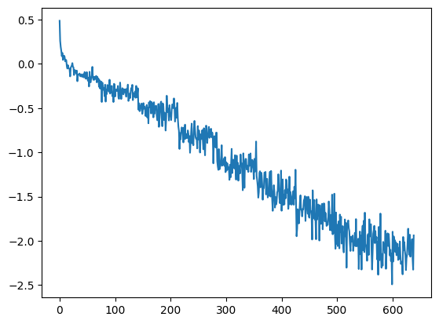
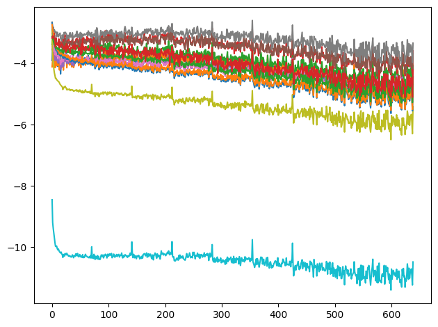
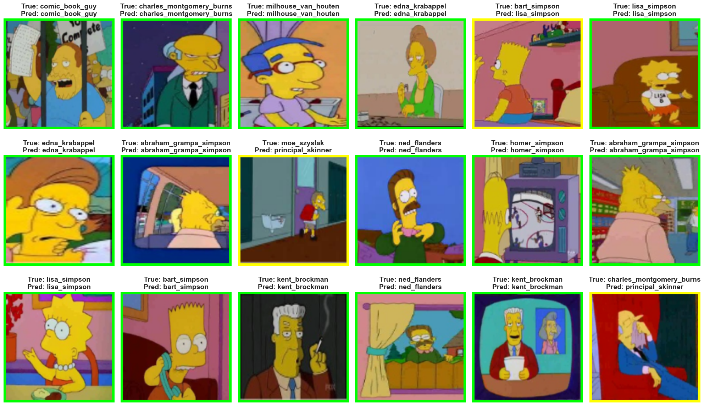

# Simpsons Character Recognition

This project implements a convolutional neural network (CNN) model for recognizing characters from "The Simpsons" TV show using PyTorch.

## Table of Contents
- [Simpsons Character Recognition](#simpsons-character-recognition)
  - [Table of Contents](#table-of-contents)
  - [Prerequisites](#prerequisites)
  - [Project Structure](#project-structure)
  - [Dataset](#dataset)
  - [Model Architecture](#model-architecture)
  - [Training](#training)
      - [Loss over time:](#loss-over-time)
      - [Learning rate \* Gradient / data:](#learning-rate--gradient--data)
  - [Evaluation](#evaluation)
- [Transfer Learning](#transfer-learning)
    - [Model Layers:](#model-layers)
    - [1. **ResNet-18 Backbone (Pretrained)**](#1-resnet-18-backbone-pretrained)
    - [2. **Classification Head**](#2-classification-head)
    - [Forward Pass:](#forward-pass)
    - [Result](#result)

## Prerequisites

- Python 3.x
- PyTorch
- pandas
- matplotlib
- Pillow
- seaborn
- OpenCV

## Project Structure

- `number_pic_char.csv`: Contains character information
- `annotation.txt`: Contains image annotations
- `simpsonsModel.pth`: Saved model weights
- `kaggle_simpson_testset/`: Directory containing test images

## Dataset
Download the dataset from here [dataset-simpsons](https://www.kaggle.com/datasets/alexattia/the-simpsons-characters-dataset)
The project uses two custom dataset classes:

1. `SimpsonsDataset`: For training data
   - Reads annotations from `annotation.txt`
   - Applies **data augmentation** this makes it to 18000 images
   - Limits the number of samples per class

2. `SimpsonsTestDataset`: For test data
   - Reads images from `kaggle_simpson_testset/`

## Model Architecture

The `SimpsonModel` class defines a CNN with the following structure:
- 2 convolutional layers (32 filters)
- 2 convolutional layers (64 filters)
- Max pooling and dropout layers
- Fully connected layers (512 units, then num_classes units)

## Training

The model is trained using:
- Cross Entropy Loss
- AdamW optimizer
- StepLR learning rate scheduler

Training parameters:
- Learning rate: 1e-3
- Batch size: 256

#### Loss over time: 

#### Learning rate * Gradient / data:
i used this plot as a refrence to adjust the hyperParameters
  

## Evaluation

The model's performance is evaluated on the test dataset, and the accuracy is reported. Additionally, a visualization function `show_model_prediction` displays the model's predictions alongside the true labels.

- Accuracy = **0.83**
  

---

# Transfer Learning

After training my model, I changed the base of my model to **ResNet-18**.
- Removed the fully connected layer
- Froze all gradients except the last convolutional layer
- Added my own fully connected layer

### Model Layers:

### 1. **ResNet-18 Backbone (Pretrained)**
   - Pretrained on `ResNet18_Weights`.
   - All layers are frozen except for `layer4`.
   - Backbone is modified to remove the last two layers, retaining feature extraction layers.

### 2. **Classification Head**
   - `Conv2d(512, 256, kernel_size=3, padding=1)`
     - Convolves 512 input channels to 256 output channels.
     - ReLU activation function.
   - `Conv2d(256, 128, kernel_size=3, padding=1)`
     - Convolves 256 input channels to 128 output channels.
     - ReLU activation function.
   - `AdaptiveAvgPool2d((1, 1))`
     - Adapts the input size to a fixed 1x1 output.
   - `Flatten()`
     - Flattens the output for feeding into fully connected layers.
   - `Linear(128, 128)`
     - A fully connected layer with GELU activation.
   - `GELU()`
     - Non-linear activation function for the linear layer.
   - `BatchNorm1d(128)`
     - Batch normalization layer with 128 features.
   - `Linear(128, num_classes)`
     - Final fully connected layer with `num_classes` output, where `num_classes` is the number of character classes to classify.

### Forward Pass:

1. Input is passed through the **ResNet-18 Backbone** to extract high-level features.
2. The extracted features are passed to the **Classification Head** for character prediction.
3. The output of the final `Linear` layer is returned as logits representing the predicted character class.

### Result

After training for 20 minutes, **The accuracy went upto 94%**. which is a significant improvement.
I could have continued training the model or unfroze some more parameters but my laptop would have exploded  (:

- Accuracy = **94%**